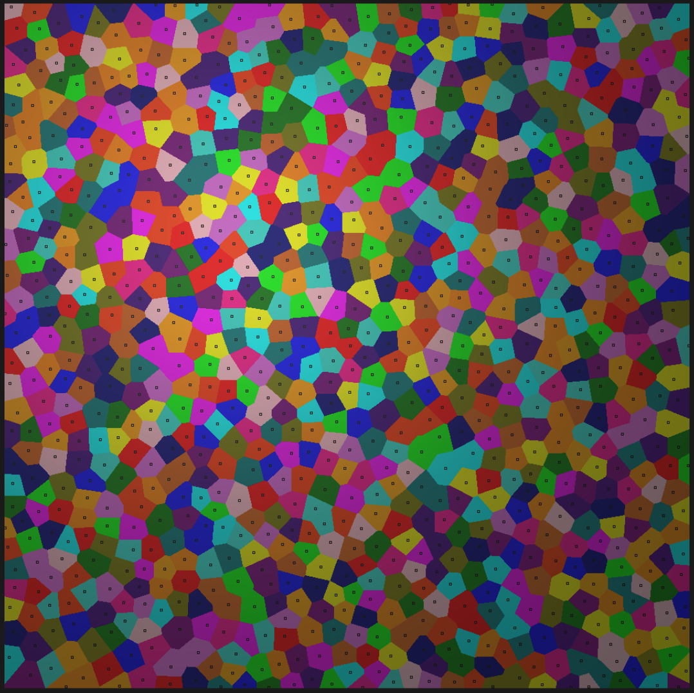

# Poisson Disk Sampling

An implementation of Bridson's algorithm for Poisson sampling.

This generates points with a minimum distance between them. 
This can give an organic feel to the resulting distribution.

Based on code and information from https://sighack.com/post/poisson-disk-sampling-bridsons-algorithm.

## Usage

```go
package main

import (
	"github.com/derekmu/poisson"
	"log"
	"math/rand/v2"
	"time"
)

func main() {
	points := poisson.Sample2D(10.0, 10, &poisson.Bounds{
		MinX: 0,
		MinY: 0,
		MaxX: 100,
		MaxY: 100,
	}, rand.NewPCG(uint64(time.Now().UnixNano()), uint64(time.Now().UnixNano()>>1)))

	for i, point := range points {
		log.Printf("Point #%d: %+v", i+1, point)
	}
}

```

## Example

Here's an example of a Voronoi diagram used to generate a texture with points generated from this library: 

